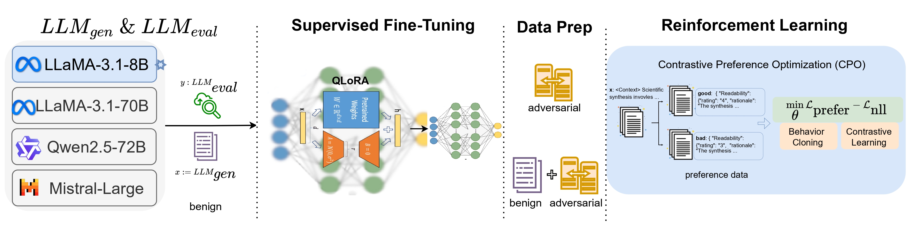

<span style="color:red">🚨🚨🚨 We will release the models on Hugging Face along with a Python library once the work is made public. 🚨🚨🚨 </span>


---

<div align="center">
  
</div>

<div align="center">


[](https://github.com/pre-commit/pre-commit)
[](https://github.com/psf/black)
[](https://pycqa.github.io/isort/)
[](https://opensource.org/licenses/MIT)


</div>

## 📋 What is the YESciEval?


Large Language Models (LLMs) drive scientific question-answering on modern search engines, yet their evaluation robustness remains underexplored. We introduce **YESciEval**, an open-source framework that combines fine-grained rubric-based assessment with reinforcement learning to mitigate optimism bias in LLM evaluators. The framework is presented as f ollows:

<div align="center">
 
</div>

We release multidisciplinary scienceQ&A datasets, including adversarial variants, with evaluation scores from multiple LLMs. Independent of proprietary models and human feedback, our approach enables scalable, cost-free evaluation. By advancing reliable LLM-as-a-judge models, this work supports AI alignment and fosters robust, transparent evaluation essential for scientific inquiry and artificial general intelligence.

## 🧪 Installation

You can also install and use the LLMs4OM using the following commands.
```
git clone https://github.com/XXX/YESciEval.git
cd LLMs4OM

pip install -r requirements.txt
mv .env-example .env
```
Next, update your tokens in `.env`  to use `LLaMA-3` LLMs. Once you installed the requirements and prepared the `.env` file, you can move forward with experimentation.


## 🗃️ ScienceQ&A Dataset

The `dataset/` directory contains data for the **BioASQ** and **ORKG-Synthesis** datasets, organized into `train` and `test` sets. Each set consists of three categories: `adversarial-extreme`, `adversarial-subtle`, and `benign`. The `dataset/` directory structured as follows:
```angular2html
dataset/
├── BioASQ
│   ├── test/
│   │   ├── adversarial_extreme/
│   │   ├── adversarial_subtle/
│   │   ├── original_synthesis/
│   │   ├── BioASQ_dataset_adversarial_extreme_clean.xlsx
│   │   ├── BioASQ_dataset_adversarial_subtle_clean.xlsx
│   │   └── BioASQ_dataset_synthesis.xlsx
│   ├── train/
│   │   ├── adversarial_extreme/
│   │   ├── adversarial_subtle/
│   │   ├── original_synthesis/
│   │   ├── BioASQ_dataset_adversarial_extreme_clean.xlsx
│   │   ├── BioASQ_dataset_adversarial_subtle_clean.xlsx
│   │   └── BioASQ_dataset_synthesis.xlsx
│   └── train_test_split_ids.json
└── ORKG-Synthesis
    ├── test
    │   ├── adversarial_extreme/
    │   ├── adversarial_subtle/
    │   ├── original_synthesis/
    │   ├── llm4syn_dataset_adversarial_extreme_clean.xlsx
    │   ├── llm4syn_dataset_adversarial_subtle_clean.xlsx
    │   ├── llm4syn_dataset_synthesis.xlsx
    │   └── original_synthesis
    ├── train
    │   ├── adversarial_extreme/
    │   ├── adversarial_subtle/
    │   ├── original_synthesis/
    │   ├── llm4syn_dataset_adversarial_extreme_clean.xlsx
    │   ├── llm4syn_dataset_adversarial_subtle_clean.xlsx
    │   └── llm4syn_dataset_synthesis.xlsx
    └── train_test_split_ids.json
```

### 📕 How to run?  

The first step is to generate adversarial sets using the `generator/` directory. However, these sets are already available in the repository. To fine-tune your judge model, follow these steps:  

1. 🤖 **Supervised Fine-Tuning (SFT):**  Run the supervised fine-tuning model with the following command:  
```cmd
   python supervised_finetuning.py
```
2. 🤖 **Reinforcement Learning (RL)** Fine-Tuning: After completing SFT, continue fine-tuning using reinforcement learning:

```cmd
python reinforcement_learning.py
```
3.   📊 **Inference and Evaluation**: To evaluate and use your judge model, run any of the `*_inference.py` scripts:
```cmd
python your_inference_script.py
```

## 📃 License

This work is licensed under a [](https://opensource.org/licenses/MIT).


