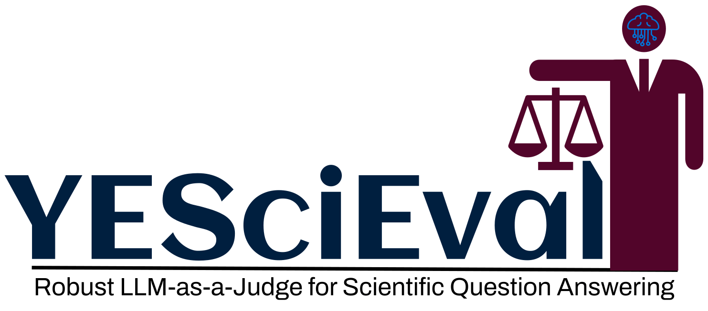

<div align="center">
 
</div>

<div align="center">


[](https://github.com/pre-commit/pre-commit)
[](https://github.com/psf/black)
[](https://pycqa.github.io/isort/)
[](https://opensource.org/licenses/MIT)


</div>

## What is the YESciEval?


Large Language Models (LLMs) drive scientific question-answering on modern search engines, yet their evaluation robustness remains underexplored. We introduce **YESciEval**, an open-source framework that combines fine-grained rubric-based assessment with reinforcement learning to mitigate optimism bias in LLM evaluators. The framework is presented as f ollows:

<div align="center">
 
</div>

We release multidisciplinary scienceQ&A datasets, including adversarial variants, with evaluation scores from multiple LLMs. Independent of proprietary models and human feedback, our approach enables scalable, cost-free evaluation. By advancing reliable LLM-as-a-judge models, this work supports AI alignment and fosters robust, transparent evaluation essential for scientific inquiry and artificial general intelligence.

## Installation

You can also install and use the LLMs4OM using the following commands.
```
git clone https://github.com/XXX/YESciEval.git
cd LLMs4OM

pip install -r requirements.txt
mv .env-example .env
```
Next, update your tokens in `.env`  to use `LLaMA-3` LLMs. Once you installed the requirements and prepared the `.env` file, you can move forward with experimentation.


## ScienceQ&A

